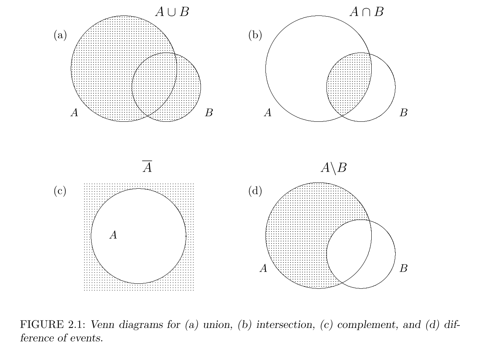
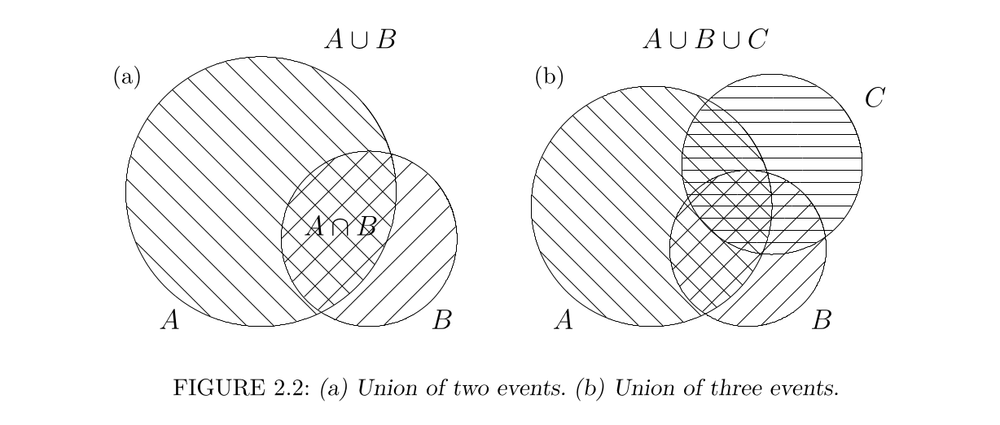

[:material-presentation: Apri Slide della Lezione](slides/index.html){ .md-button .md-button--primary target="_blank" }

# Settimana 1 — Che cos'è la probabilità?
*Un viaggio attraverso la storia, la filosofia, i paradossi e il codice della disciplina che misura l'incertezza.*

---

## Prologo: La moneta a mezz'aria e il supercomputer

Immagina di avere una moneta d'ottone tra le mani. Infili il pollice sotto il bordo, dai un colpo verso l'alto e la lanci a roteare nell'aria.

Mentre volteggia luccicando nella stanza, ti viene spontaneo porti la classica domanda: **qual è la probabilità che esca testa?**

Quasi chiunque, senza esitare, risponderebbe: *"Il 50%"*. Sembra la cosa più ovvia, evidente e indiscutibile del mondo. Ma ora fermiamo l'immagine a mezz'aria e immaginiamo un osservatore diverso: un supercomputer dotato di sensori ambientali e telecamere ad altissima velocità puntate sulla moneta. In pochi millisecondi, questa macchina misura con precisione assoluta la forza impartita dal pollice, l'angolo di lancio, la distribuzione di massa dell'ottone, l'attrito dell'aria, la pressione atmosferica e l'accelerazione di gravità.

Per quel supercomputer, la probabilità non è affatto del 50%. È del **100% testa** oppure del **100% croce**. Conoscendo le equazioni deterministiche della meccanica classica di Newton, la macchina sa già con certezza infallibile come atterrerà la moneta sul tavolo molto prima che tocchi terra.

Questo contrasto svela il paradosso fondativo dell'intera teoria della probabilità:

!!! question "La Domanda Guida"
    **Quel "50%" è davvero una proprietà fisica scolpita nella materia della moneta, oppure è solo un numero che inventiamo per mascherare la nostra totale ignoranza delle variabili fisiche in gioco?**

Se è soltanto ignoranza, allora la probabilità è un artefatto della mente umana (**approccio epistemico**). Se invece è una proprietà oggettiva del mondo esterno (**approccio ontico**), dov'è racchiusa? Come può un disco inanimato di metallo contenere al proprio interno una "tendenza intrinseca" a mostrare una faccia la metà delle volte?

Da oltre tre secoli, matematici, fisici e filosofi si affrontano in scontri accademici feroci e appassionati su questo dilemma. Quella che segue è la storia di questa avventura intellettuale: un *Erlebnis*, un'esperienza vissuta attraverso le scoperte, le crisi e i paradossi che hanno dato forma al modo in cui oggi comprendiamo il caso e progettiamo il software.

---

## Atto I: La grammatica della probabilità — Il miracolo di Kolmogorov e l'algebra degli eventi

Per capire perché la probabilità sia un terreno filosoficamente lacerato, dobbiamo partire dal 1933. In quell'anno, il matematico sovietico **Andrej Nikolaevič Kolmogorov** diede alle stampe una breve monografia in lingua tedesca: *Grundbegriffe der Wahrscheinlichkeitsrechnung* (*Fondamenti del calcolo delle probabilità*, consultabile liberamente nell'edizione inglese su [Internet Archive](https://archive.org/details/foundationsofthe00kolm)).

Prima di Kolmogorov, la probabilità era un pantano concettuale. Si poggiava su definizioni circolari, come quella di "casi ugualmente probabili" (che definisce la probabilità usando la probabilità stessa). Kolmogorov compì quello che all'epoca apparve come un miracolo matematico: inquadrò l'intera teoria all'interno della **teoria della misura** (la branca dell'analisi che formalizza le lunghezze, le aree e i volumi geometrici).

Prima di addentrarci negli assiomi, è fondamentale comprendere la base concettuale su cui poggia l'intera formalizzazione della probabilità.

---

### 1. Il fondamento concettuale: «Esperimento» ed «Esito»

Useremo in questo corso un sistema formale che poggia su due **nozioni primitive** legate da una **relazione circolare, non meglio definita**, che però ciascuno può accettare come valida senza scandalizzarsi e darne allo stesso tempo un'interpretazione del tutto ragionevole: i concetti di **"esperimento"** ed **"esito"**.

La loro relazione fondamentale racchiude infatti un'apparente tautologia:
* **"L'esito è ciò che un esperimento genera"**
* **"L'esperimento è ciò che genera esiti"**

Un esperimento aleatorio può essere semplice come il lancio di una moneta o l'estrazione di una carta, oppure complesso come la rilevazione del traffico di rete su un server o l'avvio di una nuova attività commerciale. Per trattare matematicamente un esperimento dobbiamo prima di tutto *idealizzarlo*: concordiamo in anticipo quali siano i possibili esiti escludendo le contingenze irrilevanti (la moneta che scompare in una fessura, un colpo di vento anomalo, ecc.). 

Ogni singola esecuzione dell'esperimento produce **uno e uno solo** degli esiti possibili: non si verificano mai due o più esiti contemporaneamente in una singola prova, e non accade mai che *nessun* esito si verifichi.

---

### 2. Spazio Campionario ($\Omega$) e la casistica dei regimi di cardinalità

Lo **spazio campionario** (o spazio campione), indicato universalmente con la lettera greca maiuscola $\Omega$, è l'insieme di tutti i possibili esiti di un esperimento aleatorio:
$$
\Omega = \{\omega_1, \omega_2, \dots\}
$$

!!! important "Regola aurea"
    **Lo spazio campione è sempre il primo elemento richiesto in qualsiasi problema probabilistico.** Definire con chiarezza $\Omega$ significa circoscrivere esattamente il dominio dell'incertezza.

Vediamo una casistica fondamentale di esempi per apprezzarne la varietà:

* **Esempio 1 (Discreto finito elementare — Il mazzo ridotto):**  
  Abbiamo 3 carte coperte sul tavolo: una Regina ($Q$), un Re ($K$) e un Fante ($J$). L'esperimento consiste nel pescarne una.  
  Lo spazio campione è:
  $$
  \Omega = \{Q, K, J\} \quad (|\Omega| = 3)
  $$

* **Esempio 2 (Esperimento composto con reimmissione — Prodotto cartesiano):**  
  Ripetiamo l'esperimento precedente estraendo due carte in successione con reimmissione (peschiamo una carta, annotiamo l'esito, la rimettiamo nel mazzo, mescoliamo e ripeschiamo).  
  Ogni esito è ora una coppia ordinata di carte:
  $$
  \Omega = \{QQ, QK, QJ, KQ, KK, KJ, JQ, JK, JJ\} \quad (|\Omega| = 3 \times 3 = 9)
  $$

* **Esempio 3 (Discreto infinito numerabile — La pianificazione familiare):**  
  Una coppia decide di continuare ad avere figli finché non nasce, in sequenza temporale, una femmina ($G$) seguita subito da un maschio ($B$).  
  Quali sono gli esiti possibili?  
  Scrivendo $B$ per maschio e $G$ per femmina, ogni esito è una stringa che:
  1. Termina tassativamente con la sequenza $GB$;
  2. Non contiene alcuna altra occorrenza di $GB$ prima della fine.  
  
  Alcuni esiti possibili sono:
  $$
  \Omega = \{GB, BGB, BBGB, GGB, BGGB, \dots, \underbrace{BB\dots B}_{k\text{ volte}}GB, \dots\}
  $$

  C'è un limite inferiore alla lunghezza della sequenza (almeno 2 figli: $GB$), ma **non c'è alcun limite superiore**. La stringa può essere arbitrariamente lunga. Questo dimostra un principio cardine: **gli spazi campionari non devono necessariamente essere finiti per essere matematicamente trattabili**.

* **Esempio 4 (Continuo non numerabile — Il tempo di attesa o la misura fisica):**  
  Misuriamo il tempo $T$ (in secondi) che intercorre prima che un server web riceva la prossima richiesta HTTP, oppure l'angolo $\theta$ a cui si ferma una freccia su una ruota della fortuna.  
  In questo caso gli esiti non possono essere elencati uno ad uno, ma formano un intervallo continuo:
  $$
  \Omega = [0, +\infty) \quad \text{oppure} \quad \Omega = [0, 2\pi)
  $$

  Qui la cardinalità di $\Omega$ è continua (la potenza del continuo $|\mathbb{R}|$).

---

### 3. Eventi, Diagrammi di Venn e Algebra Booleana

Un **evento** è un insieme di esiti, ovvero un **sottoinsieme dello spazio campionario** ($A \subseteq \Omega$).
* Diciamo che **un evento $A$ si verifica** se l'esito $\omega$ effettivamente prodotto dall'esperimento appartiene ad $A$ ($\omega \in A$).
* Se $\Omega$ è finito e ha cardinalità $|\Omega| = N$, il numero totale di eventi possibili (tutti i possibili sottoinsiemi, cioè l'insieme delle parti $\mathcal{P}(\Omega)$) è pari a $2^N$.
* L'intero spazio $\Omega$ è l'**evento certo** (si verifica sempre, perché l'esperimento genera sempre un esito appartenente ad $\Omega$).
* L'insieme vuoto $\emptyset$ è l'**evento impossibile** (non contiene alcun esito, dunque non si verifica mai).

#### Operazioni fondamentali tra eventi e Diagrammi di Venn

Nel 1888, il logico e filosofo britannico **John Venn** (che ritroveremo presto come uno dei massimi alfieri del polo ontico della probabilità) formalizzò l'uso di diagrammi geometrici piani per rappresentare le relazioni logiche tra insiemi. Poiché gli eventi sono sottoinsiemi di $\Omega$, le operazioni fondamentali della teoria degli insiemi corrispondono esattamente ai connettivi logici dell'informatica:



| Operazione | Notazione | Definizione insiemistica | Logica Booleana | Linguaggio Naturale |
| :--- | :--- | :--- | :--- | :--- |
| **Unione** (Fig. 2.1a) | $A \cup B$ | $\{ \omega \in \Omega \mid \omega \in A \lor \omega \in B \}$ | `A OR B` | $A$ *oppure* $B$ (almeno uno dei due) |
| **Intersezione** (Fig. 2.1b) | $A \cap B$ | $\{ \omega \in \Omega \mid \omega \in A \land \omega \in B \}$ | `A AND B` | $A$ *e* $B$ (entrambi contemporaneamente) |
| **Complemento** (Fig. 2.1c) | $\overline{A}$ o $A^c$ | $\{ \omega \in \Omega \mid \omega \notin A \} = \Omega \setminus A$ | `NOT A` | *non* $A$ (tutto tranne $A$) |
| **Differenza** (Fig. 2.1d) | $A \setminus B$ | $\{ \omega \in \Omega \mid \omega \in A \land \omega \notin B \} = A \cap B^c$ | `A AND NOT B` | $A$ *ma non* $B$ |

* **Unione ($A \cup B$):** Si verifica se si verifica $A$ *oppure* $B$ (cioè se l'esito appartiene ad almeno uno dei due insiemi).
* **Intersezione ($A \cap B$):** Si verifica se si verifica sia $A$ sia $B$ (l'esito appartiene contemporaneamente a entrambi). Se $A \cap B = \emptyset$, gli eventi si dicono *mutualmente esclusivi* o *disgiunti* (incompatibili).
* **Complemento ($\bar{A}$ o $A^c = \Omega \setminus A$):** Si verifica se e solo se $A$ *non* si verifica.
* **Differenza ($A \setminus B$ o $A \cap B^c$):** Si verifica se si verifica $A$ *ma non* $B$.
* **Eventi Esaustivi:** Una famiglia di eventi è detta esaustiva se la loro unione copre l'intero spazio campionario ($A \cup B \cup \dots = \Omega$): almeno uno di essi si verifica con assoluta certezza. Se sono anche a due a due disgiunti, formano una *partizione* di $\Omega$.

#### Proprietà algebriche e Leggi di De Morgan

Le operazioni tra eventi godono delle note proprietà algebriche di commutatività e associatività, nonché della **proprietà distributiva**:
$$
A \cap (B \cup C) = (A \cap B) \cup (A \cap C)
$$

$$
A \cup (B \cap C) = (A \cup B) \cap (A \cup C)
$$

Fondamentali nell'architettura del software e nella logica proposizionale sono le **Leggi di De Morgan**, che stabiliscono come la negazione interagisce con le congiunzioni e le disgiunzioni:

$$
(A \cup B)^c = A^c \cap B^c
$$

$$
(A \cap B)^c = A^c \cup B^c
$$

!!! tip "De Morgan nel codice"
    La prima legge afferma: *"Non è vero che accade almeno uno tra A e B"* equivale a dire *"Non accade A E non accade B"*.  
    Nel refactoring del codice, `!(condA || condB)` è logicamente identico a `(!condA && !condB)`. Nel calcolo delle probabilità, calcolare la probabilità che *"almeno un componente funzioni"* ($A \cup B$) si risolve quasi sempre passando dal complementare: $1 - P(A^c \cap B^c)$.

---

### 4. La Famiglia degli Eventi: La $\sigma$-algebra ($\mathcal{F}$)

Non sempre possiamo limitarci a prendere "qualsiasi" sottoinsieme. Quando lo spazio campionario è continuo (come la retta reale $\mathbb{R}$ o l'intervallo $[0, 1]$), considerare arbitrariamente tutti i possibili sottoinsiemi genera paradossi insolubili nella teoria della misura (esistenza di insiemi non misurabili, come nella costruzione di Vitali o nel paradosso di Banach-Tarski, dove una sfera può essere scomposta in un numero finito di pezzi e riassemblata in due sfere identiche alla prima).

Si richiede quindi che la collezione $\mathcal{F}$ degli eventi a cui possiamo sensatamente associare una probabilità sia una **$\sigma$-algebra** su $\Omega$, cioè una famiglia di sottoinsiemi di $\Omega$ chiusa rispetto alle operazioni logiche fondamentali:
1. **Contiene lo spazio intero:** $\Omega \in \mathcal{F}$;
2. **Chiusura rispetto al complemento:** Se $A \in \mathcal{F}$, allora anche $A^c \in \mathcal{F}$;
3. **Chiusura rispetto all'unione numerabile:** Se $A_1, A_2, A_3, \dots \in \mathcal{F}$, allora $\bigcup_{i=1}^\infty A_i \in \mathcal{F}$.

* **Esempio minimale (Degenere):** La più piccola $\sigma$-algebra possibile contiene solo l'evento certo e l'evento impossibile: $\mathcal{F}_{\min} = \{\emptyset, \Omega\}$.
* **Esempio massimale (Insieme delle parti):** Negli spazi discreti finiti con $|\Omega| = N$, la $\sigma$-algebra coincide quasi sempre con l'intero insieme delle parti: $\mathcal{F} = \mathcal{P}(\Omega) = 2^\Omega$, contenente $2^N$ eventi.

---

### 5. Gli Assiomi di Kolmogorov (1933)

Dati uno spazio campionario $\Omega$ e una $\sigma$-algebra $\mathcal{F}$ di eventi su $\Omega$, possiamo finalmente definire formalmente che cos'è una **misura di probabilità** $P: \mathcal{F} \to \mathbb{R}$.

Kolmogorov fissò tre soli assiomi categorici:

1. **Non-negatività:** Per qualsiasi evento $A \in \mathcal{F}$, la probabilità è non negativa:
   $$
   P(A) \ge 0
   $$

2. **Normalizzazione:** La probabilità dell'evento certo è pari a uno:
   $$
   P(\Omega) = 1
   $$

3. **$\sigma$-additività (Additività numerabile):** Se una sequenza di eventi $A_1, A_2, A_3, \dots$ è disgiunta a due a due ($A_i \cap A_j = \emptyset$ per ogni $i \neq j$), allora la probabilità dell'unione numerabile è la somma delle singole probabilità:
   $$
   P\left(\bigcup_{i=1}^\infty A_i\right) = \sum_{i=1}^\infty P(A_i)
   $$

La terna $(\Omega, \mathcal{F}, P)$ prende il nome di **spazio di probabilità**.

---

### 6. I primi teoremi della grammatica: Conseguenze immediate degli assiomi

Tutte le leggi del calcolo probabilistico derivano deduttivamente da questi tre assiomi.

#### A. Probabilità dell'evento impossibile
L'evento vuoto ha probabilità rigorosamente nulla:
$$
P(\emptyset) = 0
$$

*Dimostrazione:* Poiché $\Omega$ e $\emptyset$ sono disgiunti ($\Omega \cap \emptyset = \emptyset$) e la loro unione è $\Omega \cup \emptyset = \Omega$, applichiamo l'assioma di additività:
$$
P(\Omega) = P(\Omega \cup \emptyset) = P(\Omega) + P(\emptyset)
$$

Sottraendo $P(\Omega)$ da entrambi i membri otteniamo immediatamente $P(\emptyset) = 0$. $\square$

#### B. La regola del complementare
Per qualunque evento $A$, la probabilità che non si verifichi è pari a uno meno la probabilità che si verifichi:
$$
P(A^c) = 1 - P(A)
$$

*Dimostrazione:* Per definizione, $A$ e $A^c$ sono disgiunti ($A \cap A^c = \emptyset$) e la loro unione ricopre l'intero spazio ($A \cup A^c = \Omega$). Dunque:
$$
P(\Omega) = P(A \cup A^c) = P(A) + P(A^c) \implies 1 = P(A) + P(A^c) \implies P(A^c) = 1 - P(A). \quad \square
$$

* **Esempio informatico 1 (Antivirus):** Se un sistema è protetto contro un nuovo malware con probabilità $0.70$, la probabilità che sia vulnerabile è $1 - 0.70 = 0.30$.
* **Esempio informatico 2 (Bug nel codice):** Se un modulo software è privo di errori con probabilità $0.45$, la probabilità che contenga **almeno un bug** è $1 - 0.45 = 0.55$.

#### C. La Conseguenza Regina: La regola dell'unione e il dramma della sovrapposizione

Cosa accade se vogliamo calcolare la probabilità che si verifichi $A$ **oppure** $B$, ma i due eventi **non sono disgiunti**?

Consideriamo questo scenario reale:
> Durante la manutenzione di un'infrastruttura cloud, un disservizio di rete si verifica il lunedì con probabilità $P(L) = 0.70$, e il martedì con probabilità $P(M) = 0.50$.  
> Qual è la probabilità che si verifichi un disservizio il lunedì **oppure** il martedì?

Se applicassimo ciecamente l'additività, sommeremmo:
$$
0.70 + 0.50 = 1.20 \quad (\text{IMPOSSIBILE!})
$$

Una probabilità maggiore di 1 è una contraddizione logica insanabile. L'errore risiede nel fatto che lunedì e martedì **non sono mutualmente esclusivi**: non è affatto impossibile che la rete collassi in entrambi i giorni! Sommando $P(L)$ e $P(M)$, l'area di sovrapposizione $P(L \cap M)$ è stata **contata due volte**.

Dobbiamo quindi sottrarre la sovrapposizione:

!!! note "La Conseguenza Regina (Formula di inclusione-esclusione a 2 eventi)"
    Per due eventi qualsiasi $A$ e $B$:
    $$
    P(A \cup B) = P(A) + P(B) - P(A \cap B)
    $$

    Se e solo se gli eventi sono disgiunti ($A \cap B = \emptyset$), il termine sottratto si annulla: $P(A \cup B) = P(A) + P(B)$.

Se nell'esempio precedente la probabilità di guasto contemporaneo in entrambi i giorni è $P(L \cap M) = 0.35$, la probabilità corretta di avere almeno un guasto è:
$$
P(L \cup M) = 0.70 + 0.50 - 0.35 = 0.85 \quad (85\%)
$$

#### Estensione a tre eventi (Inclusione-Esclusione)
Se consideriamo tre eventi $A, B, C$:
$$
P(A \cup B \cup C) = P(A) + P(B) + P(C) - [P(A \cap B) + P(A \cap C) + P(B \cap C)] + P(A \cap B \cap C)
$$

*Intuizione dal diagramma di Venn:* Sommando i tre cerchi, le intersezioni doppie vengono contate due volte (quindi vanno sottratte). Ma sottraendo tutte le intersezioni doppie, la regione centrale tripla $A \cap B \cap C$ — che era stata sommata 3 volte e poi sottratta 3 volte — è sparita del tutto: va dunque ri-aggiunta alla fine.



---

### Laboratorio Computazionale: Verifica empirica della regola dell'unione {: #lab-unione }

Verifichiamo questo risultato senza fidarci ciecamente della formula, simulando $200.000$ settimane di attività dell'infrastruttura di rete. Premi **▶ Esegui** per testare il codice nel browser:

<div class="psi-exec" markdown="1">
```python
import numpy as np

# Parametri del problema
p_lunedi = 0.70
p_martedi = 0.50
p_entrambi = 0.35
n_settimane = 200000

# Simulazione Monte Carlo
# Generiamo gli stati congiunti rispettando le probabilità marginali e l'intersezione
u = np.random.random(n_settimane)
# P(L e M) = 0.35
# P(L e non M) = 0.70 - 0.35 = 0.35
# P(non L e M) = 0.50 - 0.35 = 0.15
# P(nessun guasto) = 1 - 0.85 = 0.15
L = (u < 0.70)
M = ((u < 0.35) | ((u >= 0.70) & (u < 0.85)))

p_L_sim = np.mean(L)
p_M_sim = np.mean(M)
p_inter_sim = np.mean(L & M)
p_unione_sim = np.mean(L | M)

print(f"P(Lunedì)         stimata: {p_L_sim:.4f} (teorica: 0.7000)")
print(f"P(Martedì)        stimata: {p_M_sim:.4f} (teorica: 0.5000)")
print(f"P(L ∩ M)          stimata: {p_inter_sim:.4f} (teorica: 0.3500)")
print(f"P(L ∪ M)          stimata: {p_unione_sim:.4f} (teorica: 0.8500)")
print("------------------------------------------------------------")
print(f"Somma ingenua: P(L) + P(M) = {p_lunedi + p_martedi:.2f}  <-- Errore: maggiore di 1!")
print(f"Formula regina: 0.70 + 0.50 - 0.35 = {0.70 + 0.50 - 0.35:.2f} <-- Perfetta coincidenza!")
```
</div>

La simulazione non conosce gli assiomi: conta semplicemente le settimane in cui si è verificato almeno un allarme. L'esperimento conferma in modo inequivocabile che il valore converge a $0.85$, dimostrando fisicamente la necessità di sottrarre la sovrapposizione.

---

### 7. L'Arrivo dell'Informazione: Il Condizionamento come "Zoom" nello Spazio Campionario

Finora abbiamo trattato la probabilità come una fotografia statica scattata prima dell'esperimento. Ma cosa accade quando il tempo scorre e acquisiamo **informazione parziale** prima dell'esito finale?

Consideriamo un esempio della vita quotidiana:
> Sei in aeroporto ad attendere un amico. La probabilità storica che il suo volo arrivi puntuale è dell'$80\%$ ($P(A) = 0.80$).  
> Improvvisamente il tabellone annuncia che l'aereo è decollato dalla città di partenza con un'ora di ritardo ($B$).  
> Qual è ora la probabilità che il volo atterri puntuale?  
> Chiaramente precipita: magari al $5\%$ ($P(A \mid B) = 0.05$).

La nuova evidenza $B$ ha alterato la nostra valutazione. Questa nuova grandezza è la **probabilità condizionata** di $A$ dato l'evento $B$.

#### L'operazione geometrica di "Zoom"

I diagrammi di Venn forniscono un'interpretazione visiva straordinariamente nitida:

```
        SPAZIO CAMPIONARIO ORIGINARIO Ω                     ZOOM: NUOVO UNIVERSO B
  ┌───────────────────────────────────────────┐         ┌───────────────────────────┐
  │                                           │         │  B diventa il nuovo Ω!    │
  │      ┌───────────────┐                    │         │  P(B | B) = 1             │
  │      │       B       │                    │         │  ┌─────────────────────┐  │
  │      │   ┌───────┐   │                    │  ====>  │  │                     │  │
  │      │   │ A ∩ B │   │                    │ (Zoom)  │  │       A ∩ B         │  │
  │      │   └───────┘   │                    │         │  │ (Porzione interna ad A)│
  │      └───────┬───────┘                    │         │  └─────────────────────┘  │
  │              │                            │         │                           │
  │              ▼ Tutto ciò che è fuori da B │         │  L'area di A ∩ B viene    │
  │                diventa IMPOSSIBILE (P = 0)│         │  riscalata dividendo      │
  └───────────────────────────────────────────┘         │  per l'area di B          │
                                                        └───────────────────────────┘
```

1. Quando apprendiamo con certezza che $B$ si è verificato, tutti gli esiti esterni a $B$ ($B^c$) diventano impossibili: la loro probabilità crolla a zero.
2. L'intero universo delle possibilità si contrae: **"zoomiamo" sull'insieme $B$**, che diventa il nostro **nuovo spazio campionario effettivo**.
3. All'interno di $B$, l'unico modo in cui $A$ può ancora verificarsi è attraverso la sua intersezione $A \cap B$.
4. Per soddisfare l'assioma di normalizzazione di Kolmogorov nel nuovo universo ($P(B \mid B) = 1$), dobbiamo **riscalare tutte le misure dividendo per la probabilità della condizione $P(B)$**.

Da qui discende la definizione universale:

!!! note "Definizione (Probabilità Condizionata)"
    Dati due eventi $A$ e $B$ con $P(B) > 0$, la **probabilità condizionata di $A$ dato $B$** è:
    $$
    P(A \mid B) = \frac{P(A \cap B)}{P(B)}
    $$

#### La convergenza tra interpretazione classica e frequentista
* **Nel modello classico (Laplace):** Se gli esiti sono equiprobabili, contiamo i casi favorevoli:
  $$
  P(A \mid B) = \frac{\text{Numero di esiti favorevoli in } A \cap B}{\text{Numero totale di esiti possibili in } B} = \frac{|A \cap B|}{|B|}
  $$

* **Nel modello frequentista (Venn, von Mises):** Se ripetiamo l'esperimento $N$ volte, filtriamo solo le prove in cui $B$ si è verificato (siano esse $\#B$). La frazione in cui si è verificato anche $A$ è:
  $$
  P(A \mid B) = \lim_{N \to \infty} \frac{\#(A \cap B)}{\#B} = \lim_{N \to \infty} \frac{\#(A \cap B) / N}{\#B / N} = \frac{P(A \cap B)}{P(B)}
  $$

*Esempio didattico (Il mazzo di 52 carte):*  
Peschiamo una carta coperta. Sia $A$ l'evento "la carta è un Asso" e $B$ l'evento "la carta è di Cuori".  
Senza informazioni: $P(A) = 4/52 = 1/13$.  
Se qualcuno ci rivela che la carta è di Cuori ($B$): l'intersezione $A \cap B$ è solo l'Asso di Cuori ($P(A \cap B) = 1/52$), mentre $P(B) = 13/52 = 1/4$.  
La probabilità condizionata è:
$$
P(A \mid B) = \frac{1/52}{13/52} = \frac{1}{13}
$$

Il risultato coincide perfettamente con il buonsenso: tra le 13 carte di cuori, vi è un solo asso.

---

### 8. La Regola del Prodotto e la Scomposizione Sequenziale

Riorganizzando la formula del condizionamento, ricaviamo la probabilità dell'intersezione (la **Regola del Prodotto**):
$$
P(A \cap B) = P(B) \cdot P(A \mid B) = P(A) \cdot P(B \mid A)
$$

Questa formula è la chiave per calcolare la probabilità di eventi composti che si sviluppano in sequenza temporale o logica:

* **Esempio (Estrazioni senza reimmissione):**  
  Estraiamo due carte consecutive da un mazzo da 52 senza rimettere la prima nel mazzo. Qual è la probabilità di estrarre due Assi consecutivi?
  * Prima estrazione ($A_1$): $P(A_1) = 4/52 = 1/13$.
  * Seconda estrazione ($A_2$), sapendo che un asso è già uscito: nel mazzo restano 51 carte di cui solo 3 assi, dunque $P(A_2 \mid A_1) = 3/51 = 1/17$.
  * Probabilità congiunta:
    $$
    P(A_1 \cap A_2) = P(A_1) \cdot P(A_2 \mid A_1) = \frac{1}{13} \cdot \frac{1}{17} = \frac{1}{221} \approx 0.00452
    $$

#### Fattorizzazione a catena per $n$ eventi
La regola del prodotto si generalizza a un numero arbitrario di eventi concatenati:
$$
P(A_1 \cap A_2 \cap \dots \cap A_n) = P(A_1) \cdot P(A_2 \mid A_1) \cdot P(A_3 \mid A_1 \cap A_2) \cdots P(A_n \mid A_1 \cap \dots \cap A_{n-1})
$$

Grazie alla proprietà commutativa dell'intersezione, per tre eventi $A, B, C$ esistono $3! = 6$ decomposizioni equivalenti:
$$
\begin{align}
P(A \cap B \cap C) &= P(A) \cdot P(B \mid A) \cdot P(C \mid A \cap B) \\
&= P(B) \cdot P(A \mid B) \cdot P(C \mid A \cap B) \\
&= P(C) \cdot P(A \mid C) \cdot P(B \mid A \cap C) \quad \text{e così via.}
\end{align}
$$

Questa flessibilità permette all'ingegnere di scegliere la scomposizione più comoda a seconda di quali dati condizionati siano disponibili nei log o nei test empirici.

* **Esempio informatico (Pipeline di Continuous Integration / Controllo Qualità):**  
  Un processo di rilascio software attraversa tre fasi sequenziali:
  1. $M$: la compilazione e i test unitari passano ($P(M) = 0.90$);
  2. $D$: l'analisi statica del codice approva l'architettura ($P(D \mid M) = 0.80$);
  3. $T$: i test di carico e sicurezza finali hanno successo ($P(T \mid M \cap D) = 0.95$).  
  
  La probabilità che una release superi l'intera pipeline è data dalla regola del prodotto:
  $$
  P(M \cap D \cap T) = P(M) \cdot P(D \mid M) \cdot P(T \mid M \cap D) = 0.90 \times 0.80 \times 0.95 = 0.684 \quad (68.4\%)
  $$

---

### 9. Indipendenza Stocastica e il Trabocchetto Fondamentale

Cosa succede se apprendere che l'evento $B$ si è verificato **non altera minimamente** la probabilità di $A$?

In termini formali, significa che la probabilità condizionata coincide esattamente con la probabilità a priori:
$$
P(A \mid B) = P(A)
$$

Sostituendo questa relazione nella regola del prodotto $P(A \cap B) = P(B) P(A \mid B)$, otteniamo la definizione classica di **indipendenza stocastica**:

!!! note "Definizione (Indipendenza Stocastica)"
    Due eventi $A$ e $B$ sono **stocasticamente indipendenti** se e solo se:
    $$
    P(A \cap B) = P(A) \cdot P(B)
    $$

    Per una collezione di eventi $A_1, \dots, A_n$, l'indipendenza reciproca (mutua) richiede che la probabilità dell'intersezione di qualsiasi sottoinsieme sia uguale al prodotto delle singole probabilità.

#### Proprietà dell'indipendenza
Se $A$ e $B$ sono indipendenti, allora sono mutuamente indipendenti anche tutte le loro combinazioni con i complementari:
* $A$ e $B^c$ sono indipendenti: $P(A \cap B^c) = P(A) P(B^c)$;
* $A^c$ e $B$ sono indipendenti: $P(A^c \cap B) = P(A^c) P(B)$;
* $A^c$ e $B^c$ sono indipendenti: $P(A^c \cap B^c) = P(A^c) P(B^c)$.

#### IL TRABOCCHETTO DA SRADICARE: Disgiunzione NON è Indipendenza!

!!! caution "L'errore cognitivo più diffuso negli esami universitari"
    Nel linguaggio comune diciamo che due fatti sono "indipendenti" se "non hanno nulla a che fare l'uno con l'altro", e l'immagine mentale suggerisce due cerchi separati, disgiunti.  
    **Nel calcolo delle probabilità, questa intuizione comune è completamente rovesciata:**
    
    * **Eventi disgiunti (incompatibili):** $A \cap B = \emptyset \implies P(A \cap B) = 0$.
    * **Eventi indipendenti:** $P(A \cap B) = P(A) \cdot P(B)$.

    Se due eventi $A$ e $B$ hanno probabilità positiva ($P(A) > 0$ e $P(B) > 0$) e sono **disgiunti**, allora:
    $$
    P(A \cap B) = 0 \neq P(A) \cdot P(B) > 0
    $$

    **Due eventi disgiunti non sono MAI stocasticamente indipendenti!**
    
    Al contrario, essere disgiunti rappresenta la **massima forma di dipendenza possibile**: se so che si è verificato $A$, so con certezza assoluta ($100\%$) che $B$ **non può essersi verificato** ($P(B \mid A) = 0$). Il verificarsi di uno distrugge completamente la probabilità dell'altro!

*Esempio dei voli aerei:*  
Il 90% dei voli decolla in orario ($P(D) = 0.90$), l'80% atterra in orario ($P(A) = 0.80$), e il 75% parte E arriva in orario ($P(A \cap D) = 0.75$).  
I due eventi sono indipendenti?  
Calcoliamo il prodotto delle marginali: $P(A) \cdot P(D) = 0.80 \times 0.90 = 0.72$.  
Poiché $P(A \cap D) = 0.75 \neq 0.72$, i due eventi **non sono indipendenti**.  
Inoltre: $P(A \mid D) = \frac{0.75}{0.90} \approx 0.833 > P(A) = 0.80$.  
Sapere che l'aereo è decollato in orario aumenta la probabilità di un arrivo puntuale: vi è una chiara dipendenza stocastica positiva.

---

### 10. Ingegneria della Resilienza: Affidabilità di Sistemi Software e Hardware (Reliability)

L'indipendenza stocastica è il pilastro su cui poggia l'ingegneria dell'affidabilità (*Reliability Engineering*). Quando assembliamo componenti (microservizi, dischi rigidi, sensori, collegamenti di rete) che operano o si guastano in modo indipendente, la topologia della loro connessione determina il destino del sistema.

#### A. Collegamento in Parallelo (Ridondanza e Tolleranza ai Guasti)
In un'architettura in parallelo, il sistema continua a funzionare se **almeno uno** dei componenti è operativo. Il sistema fallisce se e solo se **tutti** i componenti si guastano contemporaneamente.

```
                  ┌───[ Componente 1 (q₁) ]───┐
      ─── INGRESSO ┼───[ Componente 2 (q₂) ]───┼─── USCITA ───
                  └───[ Componente 3 (q₃ ]───┘
               (Basta che UNO funzioni: Ridondanza)
```

Siano $q_1, q_2, \dots, q_n$ le probabilità di guasto dei singoli dispositivi indipendenti.  
Per la legge di De Morgan e l'indipendenza dei complementari, la probabilità che il sistema collassi è:
$$
P(\text{Guasto totale}) = P(G_1 \cap G_2 \cap \dots \cap G_n) = \prod_{i=1}^n q_i
$$

L'affidabilità (probabilità di funzionamento) del sistema in parallelo è dunque:
$$
P(\text{Sistema Funzionante}) = 1 - \prod_{i=1}^n q_i
$$

* **Esempio reale (Affidabilità dei backup):**  
  Un server memorizza dati critici su un disco principale con probabilità di rottura annua dell'$1\%$ ($q_H = 0.01$). Per sicurezza, vengono installati 2 backup indipendenti, ciascuno con probabilità di guasto del $2\%$ ($q_{B1} = q_{B2} = 0.02$).  
  I dati vengono persi solo se tutti e tre i dischi si rompono nello stesso anno:
  $$
  P(\text{Dati perduti}) = 0.01 \times 0.02 \times 0.02 = 0.000004 \quad (4 \text{ su un milione})
  $$

  L'affidabilità del sistema passa dal $99\%$ di un disco singolo allo straordinario:
  $$
  P(\text{Dati salvati}) = 1 - 0.000004 = 0.999996 \quad (99.9996\%)
  $$

  Ecco perché l'ingegneria del software distribuisce i nodi e replica i database in parallelo!

#### B. Collegamento in Serie (La Catena degli Anelli Deboli)
In un'architettura in serie, il sistema funziona se e solo se **ogni singolo componente** funziona. Il guasto di un qualsiasi elemento causa il blocco immediato dell'intero servizio (Single Point of Failure).

```
      ─── INGRESSO ───[ Modulo 1 ]───[ Modulo 2 ]───[ Modulo 3 ]─── USCITA ───
                            (Devono funzionare TUTTI)
```

Siano $p_i = 1 - q_i$ le probabilità di funzionamento dei componenti indipendenti.  
L'affidabilità del sistema in serie è il prodotto delle singole affidabilità:
$$
P(\text{Sistema Funzionante}) = \prod_{i=1}^n p_i = \prod_{i=1}^n (1 - q_i)
$$

* **Esempio reale (Il lancio dello Space Shuttle):**  
  Il lancio programmato di uno shuttle spaziale dipende da tre sistemi avionici critici collegati in serie, operanti in modo indipendente. Le rispettive probabilità di anomalia prima del decollo sono appena dell'$1\%$, $2\%$ e $2\%$ ($q_1 = 0.01$, $q_2 = 0.02$, $q_3 = 0.02$).  
  Qual è la probabilità che il lancio avvenga in orario senza rinvii?
  $$
  P(\text{Lancio in tempo}) = (1 - 0.01) \times (1 - 0.02) \times (1 - 0.02) = 0.99 \times 0.98 \times 0.98 = 0.950792 \approx 95.08\%
  $$

  *Riflessione ingegneristica:* Nonostante i singoli componenti siano affidabili al $98-99\%$, la probabilità di fallimento dell'intero sistema è salita a quasi il $5\%$ ($1 - 0.9508 = 4.92\%$). In serie, ogni nuovo componente aggiunto degrada inesorabilmente l'affidabilità complessiva.

---

### Laboratorio Computazionale: Simulatore di Resilienza (Parallelo vs Serie) {: #lab-affidabilita }

Esplora dal vivo come cambia l'affidabilità modificando il numero di nodi di backup in parallelo o aggiungendo dipendenze critiche in serie:

<div class="psi-exec" markdown="1">
```python
p_hard_disk = 0.01     # probabilità di guasto dell'hard disk
p_backup = 0.02        # probabilità di guasto di un singolo backup
n_backup = 2           # Prova a cambiare questo valore (es. 1, 3, 5)!

# Architettura in PARALLELO: i dati si perdono solo se si rompono TUTTI
p_perduta = p_hard_disk * (p_backup ** n_backup)
p_salvata = 1.0 - p_perduta

print(f"=== ARCHITETTURA IN PARALLELO ({n_backup} nodi di backup) ===")
print(f"Probabilità di perdita totale: {p_perduta:.8f}")
print(f"Affidabilità del dato salvato: {p_salvata * 100:.6f} %\n")

# Architettura in SERIE: basta un singolo guasto per fermare il sistema
# Prova ad aggiungere o togliere moduli dalla lista!
guasti_serie = [0.01, 0.02, 0.02, 0.015] 
p_funziona_serie = 1.0
for q in guasti_serie:
    p_funziona_serie *= (1.0 - q)

print(f"=== ARCHITETTURA IN SERIE ({len(guasti_serie)} moduli critici) ===")
print(f"Affidabilità complessiva: {p_funziona_serie * 100:.4f} %")
print(f"Rischio di disservizio totale: {(1.0 - p_funziona_serie) * 100:.4f} %")
```
</div>

---

### 11. La Rivelazione: Il Contenitore Sintattico è Semanticamente Vuoto

Siamo partiti dall'esperimento e dallo spazio campionario, abbiamo costruito l'algebra degli eventi con Venn e De Morgan, introdotto la $\sigma$-algebra e gli assiomi di Kolmogorov, derivato la conseguenza regina dell'unione, il condizionamento come operazione di "zoom", la moltiplicazione a catena e l'ingegneria dell'affidabilità dei sistemi.

La macchina formale è completa, elegante, matematicamente inattaccabile. 

Eppure, proprio al culmine di questo trionfo matematico, si spalanca un'omissione gigantesca e deliberata: **Kolmogorov ha costruito un contenitore sintatticamente perfetto, ma semanticamente del tutto vuoto**.

I suoi assiomi spiegano con chirurgica precisione *come* le probabilità si sommano, si moltiplicano e si condizionano tra loro, ma non dicono una sola parola su **cosa quei numeri misurino nel mondo reale**. È come ricevere la grammatica definitiva di una lingua antica sconosciuta — con tutte le regole per le declinazioni, i verbi e i pronomi — senza avere a disposizione un dizionario. Si possono comporre frasi grammaticalmente perfette, ma non si ha la minima idea di cosa si stia dicendo.

Quando un bollettino meteorologico annuncia una *"probabilità di pioggia del 70% per domani a Varese"*, che cos'è esattamente $\Omega$? Cosa rappresenta fisicamente lo 0,70? Domani o pioverà o non pioverà; la giornata non può bagnarsi per il 70% del suo esistere.

```
                  ┌────────────────────────────────────────┐
                  │      GLI ASSIOMI DI KOLMOGOROV         │
                  │   Contenitore Sintattico Perfetto      │
                  │   P(A) >= 0,  P(Ω) = 1,  P(∪Ai) = ΣP   │
                  └───────────────────┬────────────────────┘
                                      │
                   COME RIEMPIRE QUESTO CONTENITORE?
                                      │
            ┌─────────────────────────┴─────────────────────────┐
            ▼                                                   ▼
 ┌──────────────────────┐                            ┌──────────────────────┐
 │   POLO EPISTEMICO    │                            │     POLO ONTICO      │
 │ (Conoscenza/Evidenza)│                            │ (Proprietà del Mondo)│
 │                      │                            │                      │
 │ • Soggettivo         │                            │ • Frequentista       │
 │   - de Finetti (1937)│                            │   - Venn (1866)      │
 │   - Ramsey (1926)    │                            │   - von Mises (1928) │
 │                      │                            │                      │
 │ • Logico / Oggettivo │                            │ • Propensionista     │
 │   - Laplace (1814)   │                            │   - Popper (1959)    │
 │   - Carnap (1950)    │                            │                      │
 └──────────────────────┘                            └──────────────────────┘
```

Il dramma conoscitivo è vertiginoso: **nessuna interpretazione pura nota riesce a spiegare da sola tutta la probabilità senza imbattersi in paradossi, circolarità o vicoli ciechi nel mondo reale**.

Per scoprire come l'umanità ha cercato disperatamente di dare un significato a questi numeri, dobbiamo fare un salto indietro nel tempo, fino a un'estate parigina del Seicento.

---

## Atto II: La genesi — Dalla virtù morale ai debiti di gioco (1654)

### Quando la probabilità non aveva numeri
Per capire la frattura moderna, bisogna ricordare che per secoli la parola *probabile* non ha avuto nulla a che fare con la matematica o con i conteggi. Derivata dal latino *probabilis*, indicava un'opinione degna di approvazione morale (*probata* da persone sagge, autorevoli o virtuose). 

Nel Medioevo vigeva una rigida separazione epistemologica:
* Da una parte c'era la **Scientia**: la conoscenza certa, dimostrativa, dedotta da principi primi immutabili (come la geometria euclidea o la teologia).
* Dall'altra c'era l'**Opinio**: il regno dell'incertezza, delle vicende umane, del commercio e del diritto, dove la verità assoluta era inaccessibile e ci si doveva accontentare di argomenti "probabili" (plausibili, credibili).

Nessuno studioso medievale avrebbe mai pensato di applicare i numeri o l'algebra a una scommessa: il caso era considerato espressione imperscrutabile della Provvidenza divina, e tentare di calcolarlo era quasi un atto sacrilego o un passatempo volgare per bettole.

### Il problema della partita interrotta (1654)
La frattura avvenne nell'estate del 1654. Un nobile parigino, Antoine Gombaud — noto come il *Cavaliere de Méré* —, giocatore d'azzardo professionista ma uomo di fine ingegno letterario, pose al matematico e filosofo **Blaise Pascal** una questione che toglieva il sonno agli scommettitori fin dai tempi di Luca Pacioli (1494): il **problema della divisione della posta** (*problème des partis*).

> Due gentiluomini scommettono ciascuno 32 pistole d'oro a un gioco di dadi. Vincerà l'intera posta (64 pistole) chi per primo totalizzerà 3 punti. La partita viene però interrotta bruscamente quando il Giocatore A ha 2 punti e il Giocatore B ha 1 punto. Come deve essere diviso il piatto in modo rigorosamente equo tra i due giocatori?

Se si divide la posta in proporzione ai punti fatti ($2$ contro $1$, ovvero $2/3$ ad A e $1/3$ a B), si commette un'ingiustizia: si ignora il fatto che ad A mancava un solo punto per vincere tutto, mentre a B ne mancavano due. Se si restituiscono le 32 pistole a ciascuno, si premia indebitamente B che stava perdendo.

Pascal avviò un fitto scambio epistolare con il giurista e matematico di Tolosa **Pierre de Fermat**. La loro corrispondenza nell'estate del 1654 segna l'atto di nascita della teoria matematica della probabilità.

L'intuizione folgorante di Pascal e Fermat fu di ribaltare la prospettiva: la divisione del denaro **non doveva guardare al passato (i punti già conquistati), ma pesare geometricamente i rami dei futuri possibili**.
* Se si fosse giocata una manche successiva:
  * Con probabilità $1/2$ avrebbe vinto A, raggiungendo 3 punti e intascando tutte le 64 pistole.
  * Con probabilità $1/2$ avrebbe vinto B, portando la partita sul 2 a 2 (patta). In questo scenario di parità, a ciascuno sarebbero spettate di diritto 32 pistole.
Il valore equo dell'aspettativa di vincita (il *valore atteso*) prima di giocare quella manche è dunque il valore garantito (32 pistole) più la metà del piatto conteso:

$$
\text{Spettanza di A} = 32 + \frac{1}{2}(32) = 48 \text{ pistole} \quad (3/4 \text{ del totale})
$$

$$
\text{Spettanza di B} = \frac{1}{2}(32) = 16 \text{ pistole} \quad (1/4 \text{ del totale})
$$

Per la prima volta nella storia, l'incertezza del futuro veniva domata dal calcolo esatto. Ma questo trionfo aprì una voragine filosofica che non si è mai più richiusa: cosa stiamo calcolando esattamente quando pesiamo quei rami futuri?

---

## Atto III: Il regno epistemico — La mente che lotta con l'ignoranza

I pensatori del **Polo Epistemico** sostengono una tesi radicale: la probabilità non appartiene al mondo fisico esterno, ma è la misura del nostro **stato di informazione o credenza** di fronte a una realtà che non conosciamo completamente.

### Scena 1: Pierre-Simon Laplace e il Principio di Indifferenza (1814)

Nel 1814, nel suo celebre *Essai philosophique sur les probabilités* ([Internet Archive](https://archive.org/details/philosophicaless00laplrich)), il marchese **Pierre-Simon de Laplace** formulò la più limpida apologia del determinismo universale:

> «Dobbiamo considerare lo stato presente dell'universo come l'effetto del suo stato anteriore e come la causa di quello futuro. Un'Intelligenza che per un dato istante conoscesse tutte le forze da cui la natura è animata e la situazione rispettiva degli esseri che la compongono, se per di più fosse abbastanza vasta da sottoporre questi dati ad analisi, abbraccerebbe nella stessa formula i movimenti dei più grandi corpi dell'universo e quelli del più leggero atomo: nulla sarebbe incerto per essa, e l'avvenire come il passato sarebbe presente ai suoi occhi.»

Cosa direbbe Laplace se potesse parlarci direttamente per difendere la propria visione? Ci direbbe qualcosa del genere:

> «Signori, sgombriamo subito il campo da un equivoco infantile: la Natura non conosce dadi, non conosce roulette e non conosce il caso. Se l'universo è retto dalle leggi immutabili della meccanica che Newton e io stesso abbiamo descritto nella *Mécanique Céleste*, allora ogni atomo della creazione percorre una traiettoria determinata con rigore infallibile. Un'Intelligenza suprema che abbracciasse la totalità delle forze e le posizioni iniziali di ogni corpo non scriverebbe mai un trattato sulle probabilità: per essa il futuro sarebbe presente con la medesima evidenza geometrica del passato.
>
> Ma noi non siamo quell'Intelligenza. La nostra mente è confinata entro orizzonti sensoriali ristretti. È qui che interviene la mia massima: *la teoria della probabilità non è in fondo che il buon senso ridotto a calcolo*. Essa misura con rigore matematico non una qualità misteriosa della materia, bensì lo stato della nostra informazione.
>
> Quando dichiariamo che una faccia del dado ha probabilità $1/6$, non stiamo affermando di aver misurato una forza ontologica all'interno del piombo o dell'avorio: stiamo affermando che, in virtù delle simmetrie visibili dell'oggetto e della nostra totale assenza di ragioni contrarie, la ragione ci impone di trattare i sei esiti come equivalenti. È il Principio di Indifferenza: una pietra angolare di razionalità pura. Chi cerca la probabilità nelle viscere fisiche della moneta scambia la mappa con il territorio; la probabilità è la migliore guida razionale che un intelletto finito possa concepire per navigare un mare di cui non vede i fondali.»

Per assegnare valori numerici all'ignoranza, Laplace formalizzò il **Principio di Indifferenza** (o di Ragion Sufficiente): se abbiamo davanti $N$ esiti possibili, mutualmente esclusivi e congiuntamente esaustivi, e non possediamo alcun indizio o ragione particolare per ritenere uno di essi più probabile degli altri, la ragione ci impone di assegnare a ciascuno la probabilità $1/N$:

$$
P(A) = \frac{\text{Numero di casi favorevoli ad } A}{\text{Numero totale di casi possibili}}
$$

#### La crisi di Bertrand (1889)

L'approccio di Laplace sembrava perfetto finché si giocava a dadi o con mazzi di carte da gioco. Ma cosa succede quando gli esiti possibili sono infiniti e continui, come nella geometria?

Nel 1889, il matematico francese **Joseph Bertrand**, nella sua opera *Calcul des probabilités* ([Gallica BnF](https://gallica.bnf.fr/ark:/12148/bpt6k290089)), inferse un colpo mortale all'illusione laplaciana formulando il suo celeberrimo paradosso:

> Sia dato un cerchio di raggio $R$ con un triangolo equilatero inscritto (il cui lato misura $\ell = R\sqrt{3}$). Si tracci "a caso" una corda nel cerchio. Qual è la probabilità che la corda sia più lunga del lato del triangolo?

Bertrand dimostrò che, a seconda di come si interpreta l'espressione "tracciare a caso", si ottengono tre risposte geometricamente ineccepibili, ma del tutto discordanti:

```
      METODO 1: ESTREMI                    METODO 2: RAGGIO                  METODO 3: PUNTO MEDIO
     (Uniformi sulla circonferenza)       (Distanza uniforme dal centro)     (Uniforme all'interno del disco)
              ▲                                    ▲                                    ▲
             / \                                  /│\                                  /│\
            /   \                                / │ \                                / │ \
           /     \                              /  │  \                              /  │  \
          /───────\                            /───┼───\                            /───┼───\
         /  Arc=1/3\                          /  r < R/2\                          / (R/2)²  \
        ─────────────                        ─────────────                        ─────────────
         P = 1/3 ≈ 0.333                      P = 1/2 = 0.500                      P = 1/4 = 0.250
```

1. **Metodo degli estremi casuali:** Fissiamo un estremo della corda su un vertice del triangolo. L'altro estremo viene scelto uniformemente sulla circonferenza. Affinché la corda sia più lunga del lato del triangolo, il secondo estremo deve cadere sull'arco opposto compreso tra gli altri due vertici. Tale arco misura esattamente $1/3$ della circonferenza totale.  
   **Risultato: $P_1 = 1/3 \approx 0,333$**.
2. **Metodo del raggio casuale:** Per ragioni di simmetria, fissiamo l'orientamento del raggio perpendicolare alla corda e scegliamo uniformemente la distanza $r$ del punto medio della corda dal centro ($0 \le r \le R$). Geometricamente, una corda è più lunga del lato del triangolo se e solo se il suo punto medio dista dal centro meno dell'apotema del triangolo, ovvero $r < R/2$. Poiché $R/2$ è la metà del raggio:  
   **Risultato: $P_2 = 1/2 = 0,500$**.
3. **Metodo del punto medio nel disco:** Scegliamo a caso un punto qualsiasi all'interno del cerchio come punto medio della corda. Affinché la corda sia più lunga del lato del triangolo, il suo punto medio deve cadere all'interno di un cerchio concentrico di raggio $R/2$. L'area di questo cerchio interno è $\pi (R/2)^2 = \frac{1}{4}\pi R^2$, ovvero un quarto dell'area del cerchio originario.  
   **Risultato: $P_3 = 1/4 = 0,250$**.

Tre risposte rigorose, tre valori completamente diversi. Il Principio di Indifferenza di Laplace collassò: la pura ignoranza non è in grado di specificare una distribuzione di probabilità univoca nel continuo, perché non esiste un modo naturale e neutrale di definire cosa significhi "equiprobabile" senza imporre una parametrizzazione arbitraria dello spazio.

---

### Scena 2: Bruno de Finetti e il coraggio della soggettività (1937)

Nel 1937, negli *Annales de l'Institut Henri Poincaré*, il matematico italiano **Bruno de Finetti** pubblicò una memoria che scosse le fondamenta della comunità scientifica: *La prévision: ses lois logiques, ses sources subjectives* ([NUMDAM](http://www.numdam.org/item/AIHP_1937__7_1_1_0.pdf)).

De Finetti aprì il suo saggio con una provocazione rimasta leggendaria:
> **«LA PROBABILITÀ NON ESISTE»**

Cosa replicherebbe Bruno de Finetti a chi cerca ostinatamente la probabilità nella materia? Ci direbbe qualcosa del genere:

> «Permettetemi di ribadire la tesi che per cinquant'anni ho gridato nelle aule di mezza Europa: **LA PROBABILITÀ NON ESISTE.**
>
> Non esiste come il peso, la carica elettrica o la statura. I colleghi frequentisti credono di averla trovata nelle loro "serie infinite", ma le serie infinite di eventi identici nel mondo fisico sono un miraggio metafisico. Nessuna moneta può essere lanciata all'infinito senza consumarsi, nessun paziente è la copia esatta di un altro, nessun evento storico si ripete mai identico a se stesso. Parlare di un limite per $n \to \infty$ significa basare la scienza empirica su un'operazione che nessun essere umano potrà mai completare.
>
> E allora cos'è la probabilità? È semplicemente il **grado di fiducia** che un individuo razionale attribuisce all'avverarsi di un fatto incerto. E non è affatto un'opinione arbitraria o fluttuante: la rendiamo rigorosa e oggettivamente misurabile mettendola alla prova dell'azione economica, della scommessa. Se affermi che $P(E) = p$, significa che sei pronto a considerare equo uno scambio a quel prezzo. Se le tue valutazioni violassero le regole del calcolo probabilistico, cadresti in una plateale contraddizione logica e autodistruttiva. Il calcolo delle probabilità non è la descrizione di atomi o di frequenze immaginarie: è il codice formale della coerenza logico-economica del pensiero umano.»

Ma come evitare che questa visione soggettivista sprofondi nell'arbitrio totale, rendendo impossibile la scienza? Se la probabilità è solo un'opinione nella testa delle persone, come facciamo a misurarla e a pretendere che rispetti delle regole matematiche rigorose? 

De Finetti rispose con un'idea mutuata dall'**operazionalismo scientifico** degli anni '20 (lo stesso principio per cui in fisica una grandezza esiste solo se definiamo lo strumento concreto per misurarla): **la probabilità di un evento si misura guardando quanto sei disposto a scommettere sul suo verificarsi**.

#### Il prezzo di scommessa: come pesare la fiducia

Procediamo a rallentatore, passo dopo passo:

1. **Il contratto condizionato (il "biglietto")**:  
   Immagina un certificato finanziario legato a un evento futuro e incerto, ad esempio *"Domani piove a Varese"*. Questo contratto stabilisce una regola semplicissima: se domani piove ti paga una somma fissata $S$ (poniamo $S = 100\ €$), se non piove ti paga $0\ €$.
2. **Il prezzo equo ($p \cdot S$)**:  
   Quanto saresti disposto a pagare oggi per comprare quel certificato?  
   * Se sei convintissimo che pioverà, sarai disposto a pagarlo quasi $100\ €$.  
   * Se pensi che sia quasi impossibile, non ci spenderai più di $1\ €$ o $2\ €$.  
   * Se ritieni che il prezzo equo di scambio sia $70\ €$, significa che stai valutando il rischio a una quota unitaria $p = \frac{70}{100} = 0{,}70$.
3. **La probabilità è un prezzo unitario**:  
   Quel numero $p \in [0, 1]$ non misura l'umidità delle nuvole nel cielo: misura **il prezzo monetario unitario che tu attribuisci a un guadagno condizionato all'incertezza**. 

#### La clausola dello specchio: essere sia compratore che venditore

Per evitare che chiunque spari numeri a caso, de Finetti introdusse una regola aurea (la stessa del gioco infantile della torta: *chi taglia la fetta non può scegliere quale prendere*):
> Se dichiari che il prezzo equo per vincere $S$ è $p \cdot S$, devi essere pronto **sia ad acquistare** il biglietto a quel prezzo da un avversario, **sia a vendere** lo stesso biglietto a terzi a quel medesimo prezzo, facendoti carico di pagare la vincita $S$ se l'evento si realizza.

Non puoi barare: devi avere *"la pelle in gioco"* da entrambi i lati del tavolo.

#### Il disastro del Dutch Book: perché la coerenza impone la matematica

A questo punto accade la magia. Cosa succede se attribuisci le tue probabilità in modo stravagante, senza rispettare la matematica?

Immagina di lanciare una moneta e di dichiarare:
* $P(\text{Testa}) = 0{,}60$ (prezzo equo per incassare $100\ €$: $60\ €$)
* $P(\text{Croce}) = 0{,}60$ (prezzo equo per incassare $100\ €$: $60\ €$)

A prima vista potrebbe sembrare una tua legittima opinione ottimista. Ma un allibratore o un avversario razionale ti proporrà subito due scommesse:
* Ti vende un biglietto su **Testa** a $60\ €$.
* Ti vende un biglietto su **Croce** a $60\ €$.

Tu le accetti entrambe perché le consideri entrambe eque. Cosa accade al tuo portafoglio?
* **Oggi escono dalle tue tasche**: $60 + 60 = 120\ €$.
* **Domani la moneta atterra**: o esce Testa o esce Croce. In entrambi i casi incassi la vincita di **un solo biglietto**: $100\ €$.
* **Bilancio finale**: hai perso con certezza assoluta $20\ €$ ($100 - 120 = -20\ €$), qualunque faccia mostri la moneta!

Questo meccanismo micidiale è noto come **Dutch Book** (arbitraggio puro): se le tue valutazioni violano anche solo una regola elementare del calcolo delle probabilità, un avversario può combinare una serie di scommesse che ti portano a **perdere sistematicamente denaro in ogni scenario possibile**.

Da qui discende la grandiosa conclusione di de Finetti:
> **Le valutazioni soggettive di un individuo sono immuni da perdite certe (cioè coerenti) se e solo se soddisfano esattamente gli assiomi matematici di Kolmogorov ($P \ge 0$, $P(\Omega)=1$, regola della somma).**

La matematica della probabilità non è dunque una legge fisica impressa nelle pietre o negli atomi: per de Finetti è il codice di **igiene mentale ed economica** che protegge un decisore razionale dall'autodistruzione logica.

#### Il tallone d'Achille del soggettivismo
Se da un lato de Finetti fornisce una solida base operativa agli assiomi di Kolmogorov, dall'altro apre una frattura inquietante per la scienza: se la probabilità è solo un'opinione personale internamente coerente, allora due medici o due ricercatori che esaminano la medesima cartella clinica possono legittimamente assegnare probabilità di guarigione diverse (ad esempio 0,10 e 0,90). Finché entrambi mantengono la propria coerenza interna, nessuno dei due può essere accusato di errore logico. La scienza rischia di perdere la propria pretesa di oggettività univoca e impersonale.

---

### Scena 3: Rudolf Carnap e l'illusione della macchina logica (1950)

Per salvare l'oggettività della conoscenza senza cadere nella fisica empirica dei dadi, il filosofo del Circolo di Vienna **Rudolf Carnap** tentò una via titanica nel suo trattato *Logical Foundations of Probability* (1950): trasformare la probabilità in una pura **relazione logico-sintattica oggettiva** tra enunciati.

!!! note "Carnap: Epistemico ma anti-psicologico (la probabilità logica)"
    Nella tassonomia filosofica, Carnap appartiene al polo **epistemico** perché tratta del supporto probatorio che l'evidenza conferisce a un'ipotesi ($c(h,e)$), non di frequenze fisiche della materia. Tuttavia, Carnap rifiuta categoricamente il **soggettivismo psicologico** di de Finetti: la probabilità per lui non è uno stato mentale o una fiducia individuale, ma una **relazione logico-oggettiva e a priori tra enunciati**, esattamente come l'implicazione deduttiva ($e \implies h$) è oggettivamente vera o falsa indipendentemente da chi la pensa. Un progetto grandioso di logica induttiva impersonale, ma infine **fallito**, perché la pura sintassi non è in grado di selezionare una funzione induttiva univoca.

Carnap sosteneva che, esattamente come la logica deduttiva stabilisce a priori se un enunciato $h$ segue necessariamente dalla premessa $e$ ($e \implies h$), così una logica induttiva deve stabilire un numero razionale univoco $c(h, e) \in [0, 1]$ che misura il "grado di conferma" che l'evidenza empirica $e$ conferisce oggettivamente all'ipotesi $h$.

#### Il collasso: Il continuo delle funzioni induttive e l'arbitrio del linguaggio
L'edificio logico di Carnap crollò tuttavia su se stesso. Estendendo l'analisi, Carnap scoprì che la sua proposta iniziale di misura induttiva (denotata $m^*$) era in realtà solo una tra infinite funzioni induttive possibili, parametrizzate da una costante libera $\lambda \in [0, \infty)$:

$$
c(h_{n+1}, e_n) = \frac{s_n + \lambda / k}{n + \lambda}
$$

* Se $\lambda = 0$, siamo iper-induttivi (basta un cigno nero per decretare che tutti i cigni futuri saranno neri).
* Se $\lambda \to \infty$, siamo impermeabili all'esperienza (il passato non conta nulla).

Quale valore di $\lambda$ deve scegliere la scienza? La logica sintattica tace. Inoltre, il celebre paradosso del filosofo Nelson Goodman (*l'enigma del verde e dell'indaco*) dimostrò che il grado di conferma dipende interamente dalla scelta arbitraria del vocabolario primitivo adottato. La grande macchina della probabilità logica si spense nel silenzio della formalizzazione fine a se stessa.

---

## Atto IV: Il regno ontico — La probabilità incisa nella materia

Delusi dalle ambiguità della mente, del linguaggio e delle scommesse soggettive, i pensatori del **Polo Ontico** decisero di espellere completamente l'osservatore umano dall'equazione, radicando la probabilità nella natura fisica oggettiva.

### Scena 1: John Venn e la nascita del frequentismo empirico (1866)

Nel 1866, il logico e filosofo britannico **John Venn** diede alle stampe *The Logic of Chance* ([Internet Archive](https://archive.org/details/logicofchance00venn)). Venn non sopportava l'idealismo continentale di chi fondava la scienza su dubbi o ignoranza soggettiva.

Cosa direbbe John Venn se potesse difendere la propria posizione? Ci direbbe qualcosa del genere:

> «Ascolto l'eleganza algebrica dei teorici della mente con ammirazione, ma con totale sgomento filosofico. Ci si invita a fondare una scienza quantitativa su che cosa? Sull'assenza di conoscenza! Ma dal nulla non nasce nulla: dall'ignoranza non si possono dedurre certezze matematiche né leggi fisiche per la società.
>
> Se entro in un laboratorio o negli uffici di una compagnia di assicurazioni marittime dei Lloyd's a Londra, a nessuno interessa cosa "pensa" la mia mente o quanto sia profondo il mio dubbio interiore. Ciò che conta è un dato brutale, materiale, osservabile: su centomila navi che hanno salpato dai porti britannici negli ultimi cinquant'anni, quante sono colate a picco? Questa proporzione numerica, osservata nel lungo andare di una serie uniforme di eventi, è un **fatto naturale**. È la frequenza relativa empirica.
>
> La probabilità non appartiene alle nostre credenze interiori: è incisa nella serie materiale degli eventi del mondo. E questo comporta un corollario che molti trovano scomodo ma che è ineludibile: **la probabilità del caso singolo non ha senso alcuno**. Chiedersi quale sia la probabilità che il sig. John Smith muoia all'età di 45 anni è una domanda priva di statuto logico; l'individuo o muore o sopravvive. Ha senso parlare di probabilità solo quando consideriamo il sig. Smith come membro intercambiabile di una classe di riferimento ampia e reale. Togliete l'uomo e i suoi dubbi; lasciate scorrere le serie empiriche: la probabilità è il limite materiale a cui convergono le cose.»

Per Venn, la probabilità è dunque una proprietà empirica delle serie storiche, analoga alla densità dell'acqua o al punto di fusione del piombo.

---

### Scena 2: Richard von Mises e il Collettivo infinito (1928)

Nel 1928, il matematico e ingegnere aerospaziale **Richard von Mises** portò l'intuizione di Venn al massimo vertice di rigore con il volume *Wahrscheinlichkeit, Statistik und Wahrheit* (*Probabilità, statistica e verità*).

Von Mises stabilì che ha senso parlare di probabilità solo ed esclusivamente all'interno di una classe ideale di eventi ripetibili chiamata **Kollektiv**: una successione infinita di prove empiriche $\omega = (x_1, x_2, x_3, \dots)$ caratterizzata da due assiomi inflessibili:
1. **Esistenza del limite:** La frequenza relativa con cui compare l'esito $A$ deve convergere a un limite numerico finito quando il numero di lanci tende all'infinito: $P(A) = \lim_{N \to \infty} \frac{N(A)}{N}$.

2. **Assioma di casualità (*Regellosigkeit*):** Tale limite deve rimanere identico per qualsiasi sottosuccessione infinita estratta applicando una "regola di selezione" che non guardi al futuro (ad esempio estraendo solo i lanci con indice pari, o solo i lanci con indice primo).

#### Il problema del caso singolo: L'esperimento della moneta fusa

Il frequentismo di von Mises ha dominato per quasi un secolo la pratica scientifica nei laboratori, ma presenta un tallone d'Achille epistemologico devastante: **il rifiuto assoluto del caso singolo**.

Immaginiamo questo esperimento mentale:
Prendiamo una moneta d'oro appena coniata dalla zecca. La posizioniamo su un dispositivo meccanico di lancio. Premiamo il pulsante: la moneta si alza, compie tre rotazioni e atterra mostrando **Testa**. Immediatamente dopo, raccogliamo la moneta con una pinza e la lasciamo cadere in un crogiolo d'acido nitrico bollente, dissolvendola per sempre in polvere liquida.

Ora poniamoci la domanda fondamentale: **qual era la probabilità che quella specifica moneta mostrasse testa in quell'unico lancio?**

Per Richard von Mises, la risposta è categorica e disarmante:
> «La domanda non ha alcun senso scientifico. Per una moneta distrutta non esiste alcun collettivo, non esiste alcuna sequenza infinita di prove. Parlare della probabilità di un singolo evento è un non-senso linguistico, analogo a chiedere quale sia la temperatura di una singola molecola isolata.»

Fermiamoci a riflettere: ciascuno di noi, ogni giorno, deve prendere decisioni capitali su **eventi singoli e irripetibili**:
* Qual è la probabilità che domani esploda la caldera vulcanica dei Campi Flegrei?
* Qual è la probabilità che una specifica startup informatica fallisca entro due anni?
* Qual è la probabilità che un paziente superi un'operazione al cuore a cui si sottopone una sola volta nella vita?

Se abbracciamo il frequentismo ortodosso, dobbiamo dichiarare che la probabilità non può guidare nessuna di queste scelte vitali, perché nessuno di questi eventi forma un collettivo infinito.

---

### Scena 3: Karl Popper e lo spettro della propensione (1959)

Scontento dell'incapacità del frequentismo di dare risposta al caso singolo, il celebre filosofo della scienza **Karl Popper** formulò nel 1959 l'**interpretazione propensionale** della probabilità:
> La probabilità non è un limite di frequenze su sequenze infinite, ma una **tendenza fisica reale**, una "disposizione o forza intrinseca" celata all'interno dell'assetto materiale dell'esperimento (la moneta, la gravità, il tavolo).

Per Popper, quando diciamo che la moneta ha una probabilità del 50% di mostrare testa, stiamo descrivendo una "propensione" reale della moneta a cadere in quel modo, esattamente come diciamo che il vetro ha la propensione fisica a frantumarsi se colpito con un martello.

#### Il paradosso di Humphreys (1985): La freccia del tempo spezzata

La proposta di Popper sembrava la quadratura del cerchio: salvare la realtà materiale della probabilità applicandola al caso singolo. Ma nel 1985, il filosofo della scienza **Paul W. Humphreys** inferse un colpo di grazia logico alla teoria delle propensioni.

Humphreys mise in luce una contraddizione strutturale insanabile tra la simmetria della matematica e l'asimmetria della fisica:
1. **La causalità fisica è asimmetrica nel tempo:** Le cause precedono sempre gli effetti. Una pietra lanciata contro una finestra ($C$) possiede una forte propensione a mandare in frantumi il vetro ($E$). Non ha invece alcun senso fisico sostenere che i cocci di vetro frantumati sul pavimento abbiano la propensione causale a viaggiare all'indietro nel tempo per costringere la mano del lanciatore a scagliare la pietra!
2. **La probabilità condizionata matematica è intrinsecamente simmetrica e reversibile:** Negli assiomi di Kolmogorov e nel Teorema di Bayes, se esiste la probabilità condizionata $P(E \mid C) > 0$, deve tassativamente esistere ed essere calcolabile la probabilità inversa: $P(\text{Causa} \mid \text{Effetto}) = \frac{P(\text{Effetto} \mid \text{Causa}) P(\text{Causa})}{P(\text{Effetto})}$.

Se le probabilità fossero propensioni fisiche causali, allora la probabilità condizionata inversa $P(\text{Causa} \mid \text{Effetto})$ dovrebbe rappresentare la *"propensione dell'effetto di generare retroattivamente la propria causa"*. Nel paradosso di Humphreys, significherebbe che il guscio d'uovo rotto sul pavimento possiede una misteriosa forza causale che scorre all'indietro nel tempo per farsi cadere dalle tue mani!

Poiché la matematica della probabilità può scorrere a ritroso come un filmato mentre le cause della fisica viaggiano a senso unico, **le propensioni causali non possono obbedire agli assiomi del calcolo delle probabilità**.

---

## Atto V: Frequentisti contro Bayesiani — Il paradosso di Alice e Bob

Mentre i filosofi dibattevano, nei laboratori bisognava decidere se un farmaco funzionasse o una teoria fosse valida. Tra gli anni '20 e '30 nacque così la contesa tra **statistica frequentista** e **statistica bayesiana**.

### L'approccio classico: Fisher e il p-value
Per i frequentisti (**Ronald Fisher**, **Jerzy Neyman**, **Egon Pearson**) non ha senso attribuire una probabilità a un'ipotesi: una teoria è vera o falsa. Si calcola invece il **p-value**: *se l'ipotesi nulla $H_0$ (nessun effetto / moneta equa) fosse vera, quanto sarebbe raro ottenere per puro caso un risultato così o più estremo?*

$$
\text{p-value} = P(\text{Dati uguali o più estremi} \mid H_0)
$$

Se $p < 0{,}05$ (meno del 5% di probabilità), si respinge $H_0$ e si dichiara il risultato "statisticamente significativo".

---

### Il cortocircuito: Il paradosso dell'Optional Stopping
Sembra un metodo oggettivo, ma nasconde un paradosso sorprendente (Lindley, 1957):

> **Alice** e **Bob** vogliono verificare se una moneta sia truccata. Entrambi raccolgono sul tavolo **lo stesso identico dato**:
> <p style="text-align: center; font-weight: bold; margin: 0.8em 0;">9 Teste e 3 Croci (12 lanci)</p>
>
> * **Alice** aveva deciso prima di fare **12 lanci**: per lei il calcolo dà $p \approx 0{,}073$ ($> 5\%$) $\implies$ **Moneta equa (non significativo)**.
> * **Bob** aveva deciso prima di tirare **fino alla 3ª croce**: per lui il calcolo dà $p \approx 0{,}033$ ($< 5\%$) $\implies$ **Moneta truccata (significativo!)**

```
  Dati reali sul tavolo: [ 9 Teste, 3 Croci ] (Identici!)

  Alice (regola: 12 lanci)       ──► p ≈ 0,073 (Non significativo, moneta equa)
  Bob   (regola: fino a 3 croci) ──► p ≈ 0,033 (Significativo, moneta truccata!)
```

Stessi dati fisici, verdetti opposti. Perché? Perché il p-value somma la probabilità di dati che **non sono mai accaduti** (gli esiti *"più estremi"*), che dipendono da quando il ricercatore aveva in mente di fermarsi.

---

### La risposta bayesiana: Il Principio di Verosimiglianza
Per i bayesiani (**Harold Jeffreys**, **Edwin Jaynes**) questo è inaccettabile: le intenzioni mentali dello sperimentatore non possono cambiare la natura fisica della moneta. Vale il **Principio di Verosimiglianza**: contano solo i dati realmente osservati.

$$
\text{Posterior (Nuova convinzione)} \;\propto\; \text{Prior (Convinzione iniziale)} \;\times\; \text{Verosimiglianza (Dati reali)}
$$

Avendo osservato entrambi 9 teste e 3 croci, Alice e Bob ottengono per un bayesiano **la stessa identica conclusione**.

---

## Atto VI: Uno sguardo all'abisso subatomico — Epistemico, Ontico e Non-Località

Proprio quando matematici e filosofi credevano di aver circoscritto ogni aspetto della disputa tra mente e mondo, la fisica quantistica del Novecento ha portato la contesa tra polo epistemico e polo ontico alle sue estreme conseguenze:

* **La via ontica (il caso intrinseco nella materia):** Con la regola di Max Born (1926), la probabilità entra direttamente nel cuore della materia fondamentale: a livello subatomico, la natura sembrerebbe autenticamente e irriducibilmente casuale ($P(x) = |\psi(x)|^2$). Non vi sarebbe alcun supercomputer newtoniano o demone di Laplace capace di prevedere l'esito: il caso appartiene al mondo fisico esterno.
* **La resistenza epistemica e il prezzo della non-località:** Albert Einstein rifiutò visceralmente questa resa all'azzardo (*«Dio non gioca a dadi»*), difendendo l'idea che la probabilità fosse un artefatto puramente **epistemico**, una maschera della nostra temporanea ignoranza di "variabili nascoste" che determinano deterministicamente lo stato prima della misura (come due guanti riposti in due scatole separate: chi apre la prima a Ginevra sa istantaneamente cosa c'è a Tokyo).  
Tuttavia, il celebre **Teorema di Bell (1964)** e le successive verifiche sperimentali hanno inferto un colpo decisivo a questa speranza classica: se si vuole interpretare la probabilità quantistica in senso epistemico postulando cause oggettive preesistenti, si è costretti ad ammettere che l'universo sia **intrinsecamente non-locale**. Ciò significa che eventi separati nello spazio possono influenzarsi istantaneamente.

Che si abbracci l'indeterminismo ontico o la non-località della conoscenza, la fisica moderna ribadisce la vertigine inaugurata da Kolmogorov: persino nel cuore della realtà materiale, la probabilità costringe lo scienziato a confrontarsi con il confine sottile tra ciò che appartiene al territorio del mondo e ciò che appartiene alla mappa della nostra mente.

---

## Laboratorio Computazionale: Dalla Frequenza alla Teoria — La Moneta di Pascal {: #lab-moneta }

Torniamo all'innesco iniziale della lezione: lanciamo una moneta in aria. Per il supercomputer newtoniano l'esito è certo al 100% o 0%, ma per noi umani è pura incertezza (50%). 

Cosa accade quando raccogliamo dati nel mondo reale? Premi il pulsante **▶ Esegui** per simulare **4 popolazioni di campioni indipendenti** da $N = 1.000$ lanci ciascuna. Per ogni serie calcoliamo la **media campionaria progressiva** (la frequenza relativa di Teste accumulata fino a quel momento):

$$\bar{X}_n = \frac{1}{n} \sum_{i=1}^n X_i$$

<div class="psi-exec" markdown="1">
```python
import numpy as np
import matplotlib.pyplot as plt

# Parametri dell'esperimento
n_lanci = 1000
n_campioni = 4
colori = ['#2b6cb0', '#2c7a7b', '#c05621', '#805ad5']

plt.figure(figsize=(9, 4.5), dpi=100)

for i in range(n_campioni):
    # Simulazione: 1 = Testa, 0 = Croce (moneta equa, p = 0.5)
    lanci = np.random.choice([0, 1], size=n_lanci)
    # Media campionaria progressiva (frequenza relativa cumulata)
    medie_cumulative = np.cumsum(lanci) / np.arange(1, n_lanci + 1)
    
    plt.plot(np.arange(1, n_lanci + 1), medie_cumulative, 
             label=f'Campione {i+1} (finale: {medie_cumulative[-1]:.3f})', 
             color=colori[i], alpha=0.85, linewidth=1.6)

# Valore teorico atteso (Pascal / simmetria classica: p = 0.5)
plt.axhline(0.5, color='#e53e3e', linestyle='--', linewidth=2, label='Valore teorico (p = 0.5)')

plt.title('Convergenza della Media Campionaria al Valore Teorico', fontsize=12, fontweight='bold')
plt.xlabel('Dimensione del campione (Numero di lanci N)', fontsize=10)
plt.ylabel('Media campionaria (Frequenza relativa di Teste)', fontsize=10)
plt.ylim(0.2, 0.8)
plt.grid(True, linestyle=':', alpha=0.6)
plt.legend(loc='upper right', framealpha=0.9)
plt.tight_layout()
plt.show()

print("Simulazione completata!")
print("Nei primi 50 lanci l'incertezza e le fluttuazioni sono evidenti;")
print("al crescere di N, tutte le serie si schiacciano sulla media teorica di 0.500!")
```
</div>

---

## Sintesi: Confronto tra le interpretazioni storiche

Mettiamo a confronto le quattro grandi interpretazioni, i loro punti di forza e i loro limiti concettuali:

| Teoria | Polo | Coerenza matematica | Misura empirica | Guida alle decisioni | Limite concettuale |
|---|:---:|:---:|:---:|:---:|---|
| **Classica (Laplace)** | Epistemico | ✅ Negli insiemi finiti | ⚠️ Solo se c'è perfetta simmetria | ✅ Utile nei giochi equi | Collassa negli spazi continui (Paradosso di Bertrand). |
| **Frequentista (von Mises)** | Ontico | ✅ Assiomatizzata su Kollektiv | ✅ Misurabile empiricamente | ❌ Muta sul caso singolo | Nega la probabilità agli eventi irripetibili (Moneta fusa). |
| **Propensionale (Popper)** | Ontico | ❌ Viola gli assiomi di Bayes | ⚠️ Difficile da isolare | ⚠️ Ambigua per decidere | Paradosso di Humphreys (inversione temporale causale). |
| **Soggettiva (de Finetti)** | Epistemico | ✅ Garantita dal principio di coerenza | ⚠️ Tramite quote di scommessa | ✅ La guida universale alla scelta | Rischio di arbitrio totale nelle credenze a priori. |

---

## Il Takeaway per l'Ingegnere del Software

Come informatici, programmatori e futuri architetti di sistemi intelligenti, cosa impariamo da questa vertigine epistemologica?

### 1. Il Pluralismo Pragmatico
La probabilità non è un dogma di fede, ma un prisma concettuale che dobbiamo saper orientare a seconda del problema ingegneristico:
* **Nei Big Data, nei server distribuiti e nel monitoraggio di rete**, dove fluiscono miliardi di pacchetti e log, il **frequentismo** è lo strumento principe: le medie empiriche convergono con straordinaria stabilità ai limiti asintotici.
* **Nella Cybersecurity, nell'affidabilità di sistemi critici e nel Machine Learning**, dove affrontiamo attacchi informatici inediti o decisioni mediche ad alto rischio in condizioni di scarsità di dati, l'approccio **bayesiano** è l'unico capace di guidare razionalmente l'aggiornamento della credenza.

### 2. Cos'è un A/B Test e il "Peeking Problem" moderno

#### Cos'è un A/B Test?
Nell'ingegneria del software, nello sviluppo web e nei sistemi digitali ad alto traffico, un **A/B test** è un **esperimento controllato e randomizzato** (*Randomized Controlled Trial*) condotto direttamente in produzione su utenti reali.

Il principio operativo è strutturato in tre pilastri:
1. **Suddivisione casuale del traffico (Traffic Splitting):** Quando un utente accede all'applicazione o al sito, un meccanismo di instradamento deterministico (spesso basato su una funzione di hash del suo identificativo utente) lo assegna in modo casuale e trasparente a una di due varianti:
   - **Gruppo A (Controllo):** visualizza la versione attualmente in uso (*baseline*, ad esempio il layout corrente di una pagina, il colore originario di un pulsante di acquisto o l'algoritmo di ricerca standard).
   - **Gruppo B (Trattamento):** visualizza una variante modificata del sistema (ad esempio una nuova interfaccia grafica, una procedura di checkout snellita o una strategia di raccomandazione alternativa).
2. **Misurazione della metrica obiettivo (KPI):** Durante la navigazione, il sistema traccia le interazioni per misurare una o più metriche chiave di prestazione (*Key Performance Indicators*), come il **tasso di conversione** (*conversion rate*, la percentuale di utenti che compie l'azione desiderata: acquisto, iscrizione, clic), il tempo di permanenza o la latenza percepita.
3. **Inferenza statistica formale:** L'obiettivo scientifico è determinare se la variante B apporta un reale miglioramento misurabile rispetto alla variante A, oppure se le discrepanze registrate siano compatibili con il puro rumore statistico.

Formalmente, si imposta un test di ipotesi frequentista:
- **Ipotesi Nulla ($H_0$):** La variante B non apporta alcun beneficio rispetto alla versione A ($p_B \le p_A$).
- **Ipotesi Alternativa ($H_1$):** La variante B produce un incremento significativo delle prestazioni ($p_B > p_A$).

Il protocollo statistico classico impone di determinare a priori la **dimensione campionaria fissa $N$** (tramite un'analisi di potenza, stabilendo ad esempio che servono $N = 10.000$ visite per gruppo per avere una potenza dell'80% a un livello di significatività $\alpha = 0,05$) e di **attendere la conclusione dell'intero esperimento prima di calcolare il p-value**.

#### Il vizio del "Peeking" (Optional Stopping)
Nelle aziende tecnologiche accade tuttavia quotidianamente una distorsione metodologica gravissima:
Il team rilascia l'A/B test e il manager consulta la dashboard di monitoraggio in tempo reale più volte al giorno (*data peeking*). Non appena vede che il p-value scende temporaneamente sotto $0,05$ (magari al terzo giorno, dopo appena 1.200 visite), esulta, proclama la superiorità della variante B e **interrompe immediatamente l'esperimento in anticipo** per rilasciare la nuova versione a tutti gli utenti.

Comportandosi così, il team ha replicato alla perfezione la condotta di **Bob** nell'esperimento della moneta:
- Interrompere la raccolta dei dati al primo momento in cui si osserva un esito favorevole trasforma la procedura in un **Optional Stopping**.
- Questa pratica annienta il livello di significatività nominale del 5%: la probabilità reale di incorrere in un **falso positivo** (credere che la variante B sia migliore quando invece è identica o persino peggiore di A) **esplode al 30-40% o più**!
- Innumerevoli linee di codice o modifiche di design vengono così celebrate e messe in produzione aziendale sulla base di pure fluttuazioni casuali scambiate per verità scientifiche.

---

## Epilogo: Lo specchio della nostra miopia

Siamo partiti dal contenitore vuoto e perfetto di Kolmogorov. Quando abbiamo provato a riempirlo con il disordine del mondo reale, quel contenitore si è fratturato in mille pezzi: dalle quote dei bookmaker londinesi alla moneta fusa nella fornace, dalla freccia del tempo infranta di Humphreys alla disputa di Alice e Bob fino all'abisso del mondo subatomico e al dilemma quantistico.

Questa è la bellezza vertiginosa della probabilità (e, un po' della scienza come tale): **la probabilità, come una delle discipline più significative per la scienza contemporanea poggia su un mistero filosofico irrisolto**.


---

## Riferimenti e Fonti Primarie (Open Access Online)

Tutti i testi storici ed epistemologici citati sono liberamente consultabili attraverso archivi aperti e repository accademici:

* **Andrej N. Kolmogorov (1933)** — *Grundbegriffe der Wahrscheinlichkeitsrechnung* (trad. ingl. *Foundations of the Theory of Probability*, Chelsea, 1950/1956). Testo fondativo accessibile su [Internet Archive](https://archive.org/details/foundationsofthe00kolm).
* **Pierre-Simon Laplace (1814)** — *Essai philosophique sur les probabilités* (trad. ingl. *A Philosophical Essay on Probabilities*, 1902). Disponibile su [Internet Archive](https://archive.org/details/philosophicaless00laplrich).
* **Joseph Bertrand (1889)** — *Calcul des probabilités*, Gauthier-Villars, Parigi. Testo originale custodito presso la [Biblioteca Nazionale di Francia (Gallica BnF)](https://gallica.bnf.fr/ark:/12148/bpt6k290089).
* **Bruno de Finetti (1937)** — *La prévision: ses lois logiques, ses sources subjectives*, Annales de l'Institut Henri Poincaré. Testo completo ad accesso aperto su [NUMDAM](http://www.numdam.org/item/AIHP_1937__7_1_1_0.pdf).
* **Thomas Bayes & Richard Price (1763)** — *An Essay towards solving a Problem in the Doctrine of Chances*, Philosophical Transactions of the Royal Society of London. Disponibile su [The Royal Society Publishing](https://doi.org/10.1098/rstl.1763.0053).
* **John Venn (1888, 3ª ed.)** — *The Logic of Chance*, Macmillan, Londra. Conservato su [Internet Archive](https://archive.org/details/logicofchance00venn).
* **Edwin T. Jaynes (2003)** — *Probability Theory: The Logic of Science*, Cambridge University Press. Risorse, capitoli storici e manoscritti d'autore liberamente consultabili presso il [Washington University Open Repository (bayes.wustl.edu)](https://bayes.wustl.edu).
* **Christopher A. Fuchs, N. David Mermin, Rüdiger Schack (2014)** — *An Introduction to QBism with an Application to the Locality of Quantum States*, American Journal of Physics. Articolo e preprint liberamente scaricabili da [arXiv:1311.5253](https://arxiv.org/abs/1311.5253).
* **Paul W. Humphreys (1985)** — *Why Propensities Cannot Be Probabilities*, The Philosophical Review, 94(4), 557–570.
* **James O. Berger & Donald A. Berry (1988)** — *Statistical Analysis and the Illusion of Objectivity*, American Scientist, 76(2), 159–165.
* **Alan Hájek (2019)** — *Interpretations of Probability*, Stanford Encyclopedia of Philosophy. Ampia rassegna critica consultabile ad accesso aperto su [plato.stanford.edu](https://plato.stanford.edu/entries/probability-interpret/).
